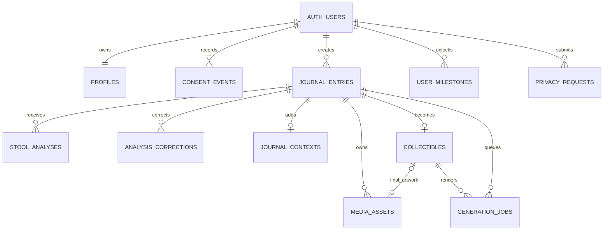

# Visual Gut Journal｜Database Schema v1.1

這份設計是目前 MVP 可以直接落地到 Supabase 的 production baseline。公開 Demo 仍使用本機模擬資料；只有登入後的真實版本會讀寫這套資料庫，兩者不共用健康資料。

## 1. 設計目標

- 支援 Email／Apple 登入後，每名使用者只能看見自己的紀錄。
- 同一天可有多次排便：每一次都是獨立 `journal_entries`，以 `local_date` 分組、`occurred_at` 排序。
- AI 判斷、使用者修正、生活 context、原圖與藝術品各自有清楚邊界。
- 原圖不公開、不放進資料庫，也不產生永久公開 URL。
- 支援 Gallery、Milestones、Doctor Review、資料匯出及刪除流程。
- 支援 AI retry／re-analysis，但由後端明確選擇 current analysis，App 不自行猜測最新結果。
- 為之後接 AI 圖片生成、成本記錄、NFT identity 預留穩定欄位。

## 2. 關聯圖



## 3. 核心資料表

| Table | 用途 | App 可直接寫入？ |
| --- | --- | --- |
| `profiles` | 顯示名稱、語言、時區、onboarding 狀態 | 只可更新自己的 profile |
| `consent_events` | 每種 Consent／Policy 版本的接受及撤回歷史 | 只可新增，不可覆寫歷史 |
| `journal_entries` | 每一次排便的日期、時間、來源及刪除狀態 | 可新增及更新自己的紀錄 |
| `stool_analyses` | 可版本化的 AI 分析；每個 entry 最多一筆 current result | 後端寫；App 只讀 |
| `analysis_corrections` | Bristol、顏色、形態、texture 的 typed 修正歷史 | 可新增；不可改舊紀錄 |
| `journal_contexts` | 核心 typed context 加小型 `extra_context` | 可管理自己的資料 |
| `media_assets` | Private Storage 路徑、retention、hash、尺寸及狀態 | 後端寫；App 只讀 |
| `collectibles` | Gutverse serial、traits、生成合約、NFT-ready identity | 後端寫；App 只讀 |
| `generation_jobs` | AI 分析／圖像／報告的排程、重試與成本 | 後端寫；App 只讀進度 |
| `user_milestones` | 已解鎖及已看過的 milestone | 可管理自己的狀態 |
| `privacy_requests` | 匯出、刪原圖、刪紀錄、刪帳號請求 | App 提交；後端處理 |

### 為什麼 AI 判斷和使用者修正要分開？

如果直接改掉 `stool_analyses.bristol_type`，日後無法知道模型原本判斷甚麼，也不能衡量模型準確度。現在每次 retry／re-analysis 都新增一筆結果，後端透過 `activate_stool_analysis()` 原子地選擇唯一 current analysis。使用者修改會新增 typed `analysis_corrections`；`journal_entry_effective_analysis` view 統一套用「最新 correction，否則 current AI」規則。

### Consent event 的粒度

每一筆 `consent_events` 只代表一種文件的一次 action，例如接受 `privacy_policy` v3 或撤回 `ai_analysis` v1。一次 onboarding 接受多份文件時會新增多筆 event；歷史不可 update 或 delete。

### 為什麼 `journal_entries` 同時保存時區與 `local_date`？

`occurred_at` 保存準確時間，`timezone_name` 和 `local_date` 用來正確顯示「今天去了兩次」及計算 7 天／月度 milestone。只用 UTC 日期會令跨時區或接近午夜的紀錄分錯日。

## 4. 圖片與 Privacy 邊界

建議建立三個 private buckets：

| Bucket | 內容 | 建議限制 |
| --- | --- | --- |
| `originals-private` | 原始排便照片 | JPEG／PNG／WebP，10 MB |
| `artworks-private` | AI base、完成藝術品、share card | JPEG／PNG／WebP，15 MB |
| `reports-private` | Doctor Summary／export PDF | PDF，20 MB |

所有 object path 固定為：

```text
<user_uuid>/<entry_uuid>/<filename>
```

例子：

```text
9f...31/2a...80/original.jpg
9f...31/2a...80/artwork-final.png
```

安全規則：

- Buckets 必須保持 private；不得使用 public URL。
- App 只能把原圖上傳至自己 UUID 開頭的資料夾。
- App 可讀自己的檔案，但不能直接 overwrite 或 delete。
- 「查看原圖」使用登入中的 authenticated download。
- 「給醫生看全部原圖與日期」由 Edge Function 在使用者再次確認後，建立短時效 signed URLs 或受保護報告。
- 刪除時由 Edge Function 先透過 Storage API 刪檔，再更新 `media_assets`；不可直接刪 `storage.objects` 的 metadata。
- `media_assets.object_path` 只保存路徑，禁止保存 `https://`、`data:` 或 `file:` URL。
- 原圖可設定 `keep`、`delete_after_analysis` 或 `delete_after_7_days`；v1.1 只保存 policy 與 `scheduled_delete_at`，尚未加入自動 scheduler。

## 5. RLS 權限模型

所有 public tables 都啟用 Row Level Security。核心原則是：

```sql
user_id = (select auth.uid())
```

| 身分 | 權限 |
| --- | --- |
| `anon` | 不可讀寫任何真實資料；公開 Demo 不連接這些 tables |
| `authenticated` | 只可讀寫自己的、且被明確授權的資料 |
| `service_role` | Edge Functions／後端使用；負責 AI 結果、資產 metadata、jobs、刪除及報告 |

特別限制：

- Client 不可寫 `stool_analyses`，避免偽造為 AI 判斷。
- Client 不可呼叫 `activate_stool_analysis()`；current result 只由 trusted backend 切換。
- Client 不可寫 `collectibles.serial` 或 `trait_fingerprint`，避免重複 identity。
- Client 不可把自己的 `privacy_request` 指向另一名使用者的 entry。
- Client 沒有 hard delete `journal_entries` 的權限；App 先標記 `pending_deletion`，後端完成 Storage 清理後才永久刪除。
- `service_role` key 絕不可放進 Expo App、瀏覽器 bundle 或公開環境變數。

## 6. 一次紀錄的完整資料流

1. App 建立 `journal_entries`，同時記錄使用者時區與 local date。
2. App 把原圖上傳到 `originals-private/<uid>/<entry_id>/...`。
3. Edge Function 建立 `media_assets` metadata，呼叫分析 API。
4. 後端寫入不可由 client 修改的 `stool_analyses`，成功後選為 current analysis。
5. 使用者確認或新增 typed `analysis_corrections`，再填寫 `journal_contexts`。
6. 後端建立 `collectibles` identity 及 `generation_jobs`。
7. 圖像生成完成後，後端上傳到 `artworks-private`、建立 `media_assets`，並更新 `collectibles.final_asset_id`。
8. App 透過 `journal_entry_effective_analysis` 取得一致的 effective classification，再顯示 Detail、Gallery、Milestones 和 Doctor Review。

## 7. MVP 先做與暫緩項目

MVP migration 已包含未來需要的主要資料邊界，但第一輪接 App 時只需啟用：

1. `profiles`
2. `consent_events`
3. `journal_entries`
4. `stool_analyses`
5. `analysis_corrections`
6. `journal_contexts`
7. `media_assets`
8. 三個 private buckets

第二階段再接：

- `collectibles` + `generation_jobs`：真正 AI artwork pipeline。
- `user_milestones`：跨裝置同步解鎖狀態。
- `privacy_requests`：Doctor Report、完整匯出及正式刪除 workflow。
- Subscription、paywall、分享成效、product analytics：先在付費與留存實驗規格確定後另開 migration，不混進健康核心資料。
- NFT mint transaction／wallet：現在只保留 off-chain identity，不儲存錢包或上鏈健康資料。

## 8. 部署與接入順序

1. 建立獨立的 Supabase development project，不連公開 Demo。
2. 執行 `202608300001_initial_core_schema.sql`。
3. 在 Dashboard／Storage API 建立三個 private buckets 及 MIME／size limits。
4. 執行 `202608300002_storage_policies.sql`。
5. 執行 `202608300003_v1_1_architecture_optimization.sql`。
6. 執行 `supabase/tests/v1_1_rls.sql`，以兩個測試帳號驗證 view 與跨帳號拒絕。
7. 實作 Auth Session 與 repository layer，把 Zustand 改成 UI cache；Supabase 才是登入版本的 source of truth。
8. 實作 upload/analyse/generate/delete Edge Functions，再接真正 API。
9. 測試完整資料刪除、signed URL 到期、網路中斷重試及同一天多次紀錄。

## 9. 對應檔案

- Core tables、indexes、constraints、RLS：`supabase/migrations/202608300001_initial_core_schema.sql`
- Private Storage policies：`supabase/migrations/202608300002_storage_policies.sql`
- v1.1 versioning、retention、consent、cost 與 effective view：`supabase/migrations/202608300003_v1_1_architecture_optimization.sql`
- v1.1 cross-account／view test：`supabase/tests/v1_1_rls.sql`

這一版刻意沒有把公開 Demo 的三筆 sample data 寫進 production database。Demo 繼續由本機 sample store 提供，避免匿名測試資料與真實健康資料混在一起。
